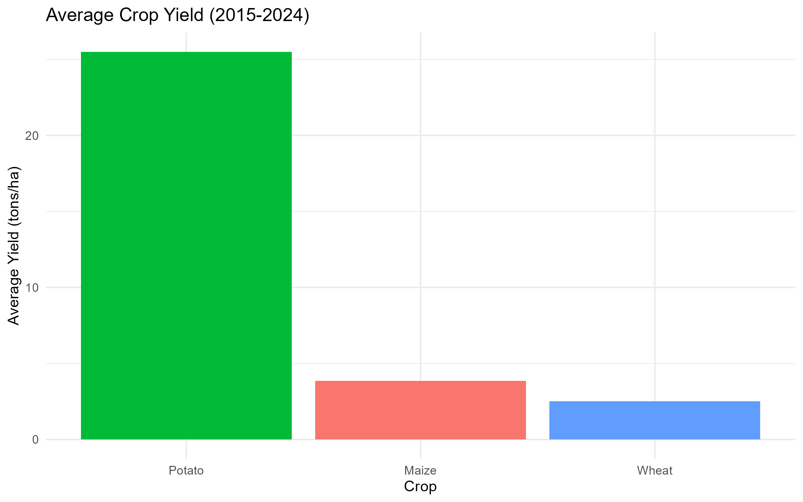

# Crop Yield Analysis (2015-2024)



A comprehensive analysis of crop yield trends across three countries (Nepal, India, USA) and three major crops (Potato, Maize, Wheat) from 2015 to 2024.

## 📊 Project Overview

This project analyzes agricultural productivity trends using R and visualizes key insights through data visualization. The study focuses on:

- **Countries**: Nepal, India, USA
- **Crops**: Potato, Maize, Wheat
- **Time Period**: 2015-2024 (10 years)
- **Metrics**: Yield in tons per hectare

## 👤 Author

**Anjana Poudel**  
Agricultural Researcher | Data Scientist  
- ORCID: [0009-0006-2829-5957](https://orcid.org/0009-0006-2829-5957)
- Specialization: Plant physiology and crop improvement
- Proficient in R and Python for agricultural data analysis

## 📁 Project Structure
CropYieldAnalysis/
├── data/
│ └── sample_crop_yield.csv # Raw dataset
├── plots/ # Generated visualizations
│ ├── potato_trend.png # Potato yield trends
│ ├── avg_crop_yield.png # Average yields by crop
│ └── yield_by_country.png # Yield distribution by country
├── scripts/
│ └── analysis.R # Main analysis script
├── .gitignore # Git ignore file
└── README.md # This file


## 🚀 How to Reproduce the Analysis

### Prerequisites
- R (≥ 4.0.0)
- RStudio (recommended)
- Required R packages:
  ```r
  install.packages(c("tidyverse", "ggthemes", "readr"))

  Steps to Run
Clone this repository:
git clone https://github.com/Anjana-Poudel-789/CropYieldAnalysis.git
cd CropYieldAnalysis
Open scripts/analysis.R in RStudio
Run the entire script to:
Load and clean the data
Generate all visualizations
Save plots to the plots/ directory

📈 Key Findings
1. Overall Crop Performance
Average Crop Yield

Potato shows the highest average yield (~24 tons/ha)
Maize demonstrates moderate productivity (~4.5 tons/ha)
Wheat has the lowest average yield (~2.5 tons/ha)
2. Geographic Yield Differences
Yield Distribution

USA consistently leads in productivity across all crops
India shows intermediate performance
Nepal has the lowest yields but demonstrates strong growth potential
3. Temporal Trends
Potato Yield Trend

All countries show positive yield trends over the decade
Notable growth: Nepal's wheat production increased by 75% (2015-2024)
Stable performance: USA maintains consistent productivity leadership
📊 Data Insights
Yield Growth Rates (2015-2024)
| Crop   | Nepal | India | USA  |
|--------|-------|-------|------|
| Potato | +46%  | +40%  | +30% |
| Maize  | +40%  | +37%  | +20% |
| Wheat  | +75%  | +45%  | +30% |

Key Observations
Nepal shows the highest growth potential, especially in wheat production
India demonstrates balanced growth across all crops
USA maintains productivity leadership with moderate growth rates
All countries show consistent upward trends, indicating positive agricultural development

📚 Dataset Description
Source: Agricultural yield statistics database
Format: CSV (90 records × 4 columns)
Variables:
Year: Observation year (2015-2024)
Country: Nepal, India, or USA
Crop: Potato, Maize, or Wheat
Yield: Productivity in tons per hectare

🔧 Technical Details
Analysis Workflow
Data Import: Using readr::read_csv()
Data Cleaning: Filtering NA values and selecting relevant columns
Visualization: ggplot2 with custom themes
Output: High-resolution PNG images (300 DPI)

R Packages Used
tidyverse: Data manipulation and visualization
ggthemes: Professional plot themes
readr: Efficient data import
📄 License
This project is licensed under the MIT License - see the LICENSE file for details.

🤝 Contributing
Contributions are welcome! Please feel free to submit a Pull Request. For major changes, please open an issue first to discuss what you would like to change.

📞 Contact
Anjana Poudel

Email: poudelanjana2057@gmail.com

GitHub: @Anjana-Poudel-789
